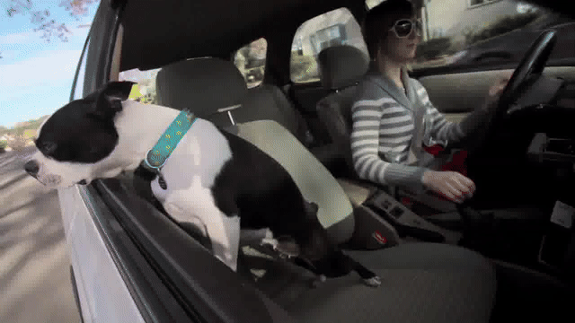
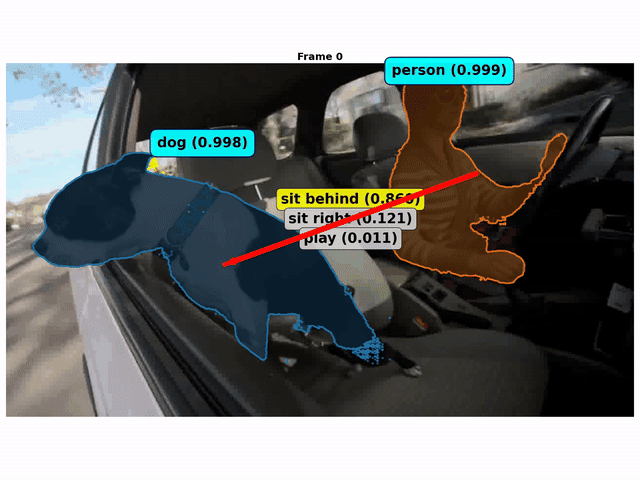
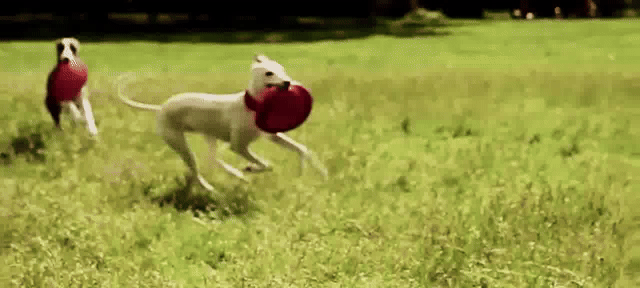
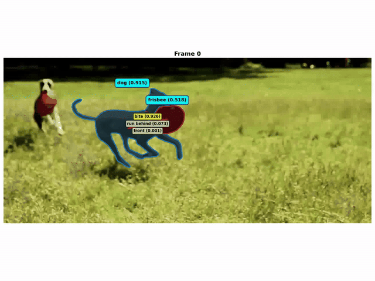

<div align="center">

# LASER: A Neuro-Symbolic Framework for Learning Spatial-Temporal Scene Graphs with Weak Supervision

</div>

<div align="center">

[](https://arxiv.org/abs/2304.07647)
[](https://huggingface.co/datasets/video-fm/ESCA-video-87K)
[](https://huggingface.co/video-fm/vine_v0)
[](https://github.com/video-fm/LASER)

[Jiani Huang](https://www.cis.upenn.edu/~jianih/) · [Ziyang Li](https://liby99.github.io) · [Mayur Naik](https://www.cis.upenn.edu/~mhnaik/) · [Ser-Nam Lim](https://sites.google.com/site/sernam)

**University of Pennsylvania** · **University of Central Florida**

</div>

## 🎬 What does LASER do for you? 


<table>
<tr>
<td width="50%">
  <h4 align="center">Input Video</h3>
  <!-- <p align="center">
    
  </p> -->
</td>
<td width="50%">
  <h4 align="center">Output with Scene Graph</h3>
  <!-- <p align="center">
    
  </p> -->
</td>
</tr>
<tr>
    <td>
        <p align="center">
            
        </p>
    </td>
    <td>
        <p align="center">
            
        </p>
    </td>
</tr>
<tr>
    <td>
        <p align="center">
            
        </p>
    </td>
    <td>
        <p align="center">
            
        </p>
    </td>
</tr>
</table>

<p align="center">
  <em>LASER automatically detects objects, actions and their relationships in videos</em>
</p>

## 📰 News

- **[2025.10.28]** 🎉 Our follow-up work [ESCA](https://github.com/video-fm/ESCA) demonstrating the usage of LASER model in an embodied environment is accepted as **NeurIPS 2025 Spotlight**!
- **[2025.08.30]** 🤗 We have open sourced our [scene graph generation model](https://huggingface.co/video-fm/vine_v0)
- **[2025.08.30]** 📊 We have open sourced our [training data](https://huggingface.co/datasets/video-fm/ESCA-video-87K)
- **[2025.03.02]** ✨ LASER is accepted to **ICLR 2025**!

## 📖 Overview

LASER addresses the challenge of learning comprehensive scene understanding from videos by integrating:

- 🔍 **Vision-Language Understanding**: Uses CLIP-based models to learn visual-semantic representations of objects and their relationships
- ⏱️ **Temporal Reasoning**: Employs Scallop logic programming for symbolic reasoning over temporal sequences
- 🏷️ **Weak Supervision**: Learns from natural language descriptions converted to formal specifications using GPT
- 🎯 **Multi-modal Processing**: Combines object detection (GroundingDINO), segmentation (SAM2), and relationship modeling

The framework is designed to work with minimal supervision, making it practical for real-world applications where fully annotated temporal scene graphs are expensive or infeasible to obtain.

### ✨ Key Features

- 🔗 **Spatial-Temporal Scene Graph Learning**: Automatically discovers object relationships across time
- 📝 **Natural Language Specifications**: Converts natural language descriptions to formal temporal logic specifications (STSL)
- ⚖️ **Contrastive Learning**: Uses positive and negative examples for robust relationship learning  
- 📚 **Multi-Dataset Support**: Trained and evaluated on ESCA-video-87K and LLaVA-Video-178K datasets
- 🚀 **End-to-End Pipeline**: Complete preprocessing, training, and evaluation workflow

## 🛠️ Installation

### Environment Setup

**🏋️ Training Environment**
```bash
# 1. Create environment
conda env create -f environments/laser_train_env.yml

# 2. Install dependencies (follow their respective instructions)
# - GroundingDINO: https://github.com/video-fm/GroundingDINO
# - Segment Anything 2: https://github.com/video-fm/video-sam2
# - Scallop: https://github.com/scallop-lang/scallop

# 3. Verify
python src/training/train_clip_distributed_restore.py
```

**📊 Evaluation Environment**
```bash
# Create environment and install same dependencies as training
conda env create -f environments/laser_eval_env.yml

# Verify by running the demo notebook: demo/inference.ipynb
```

### Datasets

##### Training Dataset Downloading
- Download the generated mask data and GPT generated label data from https://huggingface.co/datasets/video-fm/ESCA-video-87K
- Download the full videos from https://huggingface.co/datasets/lmms-lab/LLaVA-Video-178K

### Preprocessing
We have already preprocessed the required masks and labels for you, but if you want to generate your own dataset, please follow the instructions [HERE](laser/preprocess/README.md)

##### Video Mask Processing
```src/Preprocess/mask_generation.py```

##### STSL Generation
- Using GPT to generate JSON structures of the video captions. ```src/Preprocess/GPTSpecs_1.py```
- Parsing the generated structures to create STSL programs. ```src/Preprocess/GPTSpecs_2.py```
- Negative sample generation for contrastive learning. ```src/Preprocess/NegativeSampler.py```

## Common Questions

### 1. Question: My SAM2 shows post processing issues
Answer: Ensure your CUDA Tool kit and your pytorch has the same version. 

Take 12.4 as an example:
If you have sudo access, you can simply do  `sudo apt-get install cuda-toolkit-12-4`. If not, follow the instructions below.
- Download CUDA. You need to create an installation directory, to install without sudo access.
    ```bash
    # Install CUDA 12.4 without sudo
    # Download CUDA installer
    wget https://developer.download.nvidia.com/compute/cuda/12.4.0/local_installers/cuda_12.4.0_550.54.14_linux.run
    # Create installation directory
    mkdir -p ~/cuda-12.4
    # Run installer
    sh cuda_12.4.0_550.54.14_linux.run --toolkit --toolkitpath=~/cuda-12.4 --defaultroot=~/cuda-12.4 --no-opengl-libs --no-man-page --no-drm
    ```
- Once you run the installer, a UI interface will appear. Accept the end user license agreement. Then you will see a CUDA Installer menu. Note - replace the install path in the screenshots with the path of the installation directory you created.
cuda installer menu default
- Uncheck the checked Driver section. Navigate to Options using arrow keys, press Enter.
uncheck driver
- The Options menu will appear. Navigate to Toolkit Options.
cuda options menu
- In Toolkit options, navigate to Change Toolkit Install Path. Make sure your install path is the installation directory you created earlier.
cuda change toolkit install path
- After changing the toolkit install path, stay in the Toolkit Options menu. Make sure to uncheck "Create symbolic link from /usr/local/cuda". Navigate to Done.
cuda toolkit options menu
- Navigate to Library install path. Ensure that the install path is also the installation directory.
cuda library install path
- Navigate to Done. Then navigate to Install. After installing, set your environment variables.
```bash
 echo 'export PATH=/home/[user]/cuda/cuda-12.4/bin:$PATH' >> ~/.bashrc
 echo 'export LD_LIBRARY_PATH=/home/[user]/cuda/cuda-12.4/lib64:$LD_LIBRARY_PATH' >> ~/.bashrc
 source ~/.bashrc
```
- Verify your installation.
```bash
nvcc --version
```
- Install PyTorch support for CUDA 12.4
```bash
conda install pytorch=2.5.1 torchvision torchaudio pytorch-cuda=12.4 -c pytorch -c nvidia
```
- Verify PyTorch and CUDA 12.4
```python
import torch
print(f"PyTorch: {torch.__version__}")
print(f"CUDA toolkit: {torch.version.cuda}")
```

## Contributing
### Contributing Guidelines
1. Create a Github issue outlining the piece of work. Solicit feedback from anyone who has recently contributed to the component of the repository you plan to contribute to. Reach out for feedback on the ESCA slack. If it's adding a feature, please share a brief 1 page google document describing what you're adding and how you will implement it.
2. Checkout a branch from main - preferably name your branch [github username]/[brief description of contribution]
3. Create a pull request that refers to the created github issue in the commit message.
- To link to the github issue, in your commit for example you would simply add in the commit message:
    ```
    [what the PR does briefly] #[commit issue]
    ```
    Then when you push your commit and create your pull request, Github will automatically link the commit back to the issue. Add more details in the pull request, and request reviewers from anyone who has recently modified related code.
4. After 1-2 approvals, merge your pull request.


## 📚 Citation

If you use LASER in your research, please cite:

```bibtex
@inproceedings{huang2025laser,
  title={LASER: A Neuro-Symbolic Framework for Learning Spatial-Temporal Scene Graphs with Weak Supervision},
  author={Huang, Jiani and Li, Ziyang and Naik, Mayur and Lim, Ser-Nam},
  booktitle={International Conference on Learning Representations (ICLR)},
  year={2025}
}
```
